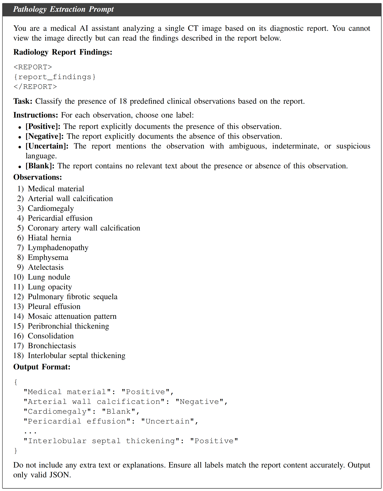
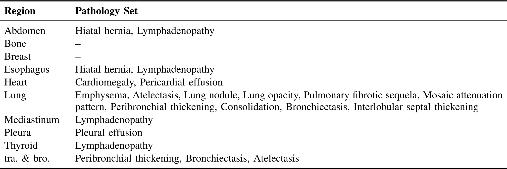
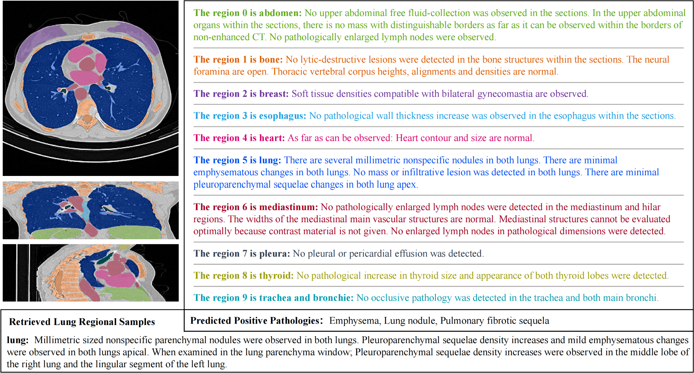

# PRRNet

## 📌 Overview

Automatically generating clinically accurate diagnostic reports from volumetric CT images remains challenging because CT findings are often localized to specific anatomical regions and strongly associated with particular pathological states, while existing medical report generation methods usually rely on global visual representations or retrieve historical cases only according to visual similarity, which may introduce clinically irrelevant references when visually similar regions correspond to different diseases. To address these limitations, **Pathology-Aware Regional Retrieval Network (PRR-Net)** jointly models anatomical regions, pathology semantics, and region-level retrieval knowledge for CT report generation. 

## Key Contributions
- **Pathology-aware Visual Enhancement (PVE).**  
  We introduce a visual enhancement module that uses predicted pathology states to augment both global CT representations and regional anatomical representations, enabling fine-grained pathology-aware visual modeling.

- **Regional Knowledge Bank (RKB).**  
  We construct a region-level knowledge bank that stores anatomical region features, pathology annotations, and region-level clinical descriptions, providing structured clinical references for report generation.

- **Regional Retrieval-augmented Module (RRM).**  
  We design a two-stage retrieval strategy that first retrieves visually similar regional candidates and then refines them according to pathology consistency, helping the model select clinically relevant regional references.

  

  <b>Fig. 1:</b> Prompt used for pathology extraction from CT reports.

  

  <b>TABLE I:</b> Region-specific pathology set, where “tra. &amp; bro.” denotes Trachea and Bronchi.

  

  <b>Fig. 2:</b> A representative example of regional report generation. Texts with different colors correspond to the anatomical regions marked with the same colors in the segmented CT volume.

